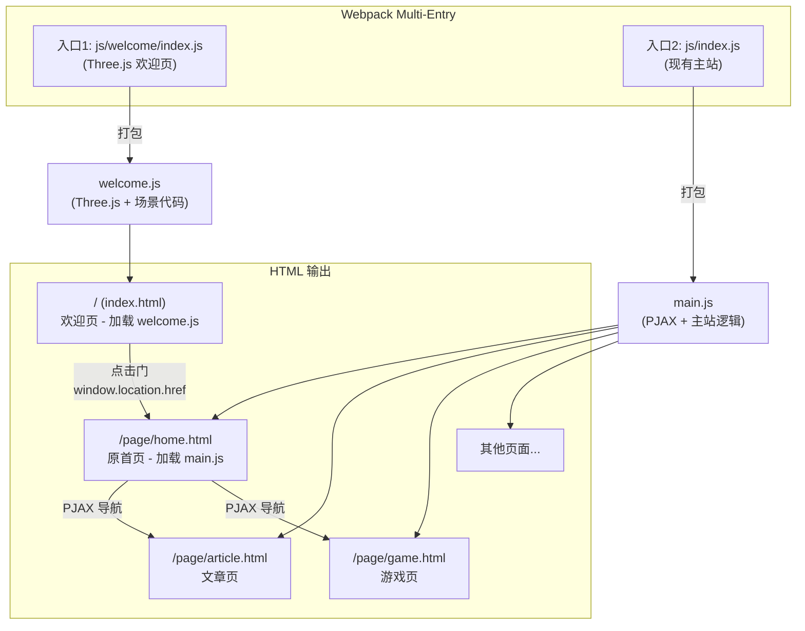

## 用户需求

为 TwinkleTwinkle 个人网站新增一个 3D 欢迎页作为网站入口。

## 产品概述

在现有 Windows 98 复古风个人网站基础上，新增一个基于 Three.js 的 3D 欢迎页。该页面展示一个宇宙深空中的 Minecraft 风格浮空岛场景，作为网站的第一入口。用户通过点击浮空岛上小屋的门触发跳转，进入现有主页。

## 核心功能

1. **3D 浮空岛场景**: 画面中央（占画面约三分之一）展示一个 Minecraft 体素风格的宇宙浮空岛，岛上有一座小屋，摄像机平视、焦段约 35mm
2. **小屋门交互**: 点击小屋门时，门模型状态变化（开门动画），随后跳转到现有主页
3. **宇宙深空背景**: 背景为深空星域，包含星星闪烁和流星划过的动态效果
4. **路由整合**: 欢迎页成为网站根路径 `/`，现有密码首页迁移到 `/page/home.html`

## 技术栈

- **3D 引擎**: Three.js (npm 安装，Webpack 打包 -- 与项目现有构建流合一)
- **构建工具**: 现有 Webpack 5，新增多入口配置（欢迎页独立入口，避免主应用 bundle 加载 Three.js）
- **模板**: EJS (复用现有模板体系)
- **样式**: 独立 welcome.css（不加载 98.css 和主站 CSS）

## 实现方案

### 整体策略

采用 **Webpack 多入口 (Multi-Entry)** 架构，将欢迎页作为独立入口点，与现有主应用完全解耦。欢迎页仅加载 Three.js 和自身逻辑，不加载 PJAX、98.css、LangManager 等主站依赖。点击门后通过 `window.location.href` 整页跳转到主站。

这样做的原因：

1. **性能隔离**: Three.js 约 600KB (未压缩)，不应污染主站 bundle，主站也不需要 Three.js
2. **生命周期简单**: 欢迎页是纯 3D 场景，跳转后直接销毁，不需要与 PJAX 共存
3. **零侵入**: 对现有主站逻辑的修改极小（仅路由路径微调）

### 关键技术决策

**1. Three.js 引入方式 -- npm install**

- 项目已有完整 Webpack 构建链，npm 安装可被 Tree-shaking（仅导入使用的模块 `import { Scene, PerspectiveCamera, ... } from 'three'`）
- CDN 方式无法 Tree-shaking，且与现有 ES Module 导入风格不一致

**2. 体素模型实现 -- 纯代码 BoxGeometry 构建**

- Minecraft 风格本质是体素（方块堆叠），用 `THREE.BoxGeometry` + 自定义颜色/材质即可精确还原
- 不需要外部建模工具和 GLTF 加载器，减少依赖和资源体积
- 浮空岛 = 底部不规则岩石层（深灰/棕色方块）+ 顶部草地层（绿色）+ 小屋（木色墙 + 深色屋顶 + 门）
- 使用 `THREE.InstancedMesh` 优化大量方块的渲染性能（单次 draw call）

**3. 路由方案 -- 欢迎页占据 `/`，原首页迁移到 `/page/home.html`**

- 将 `ejs/pages/index.ejs` 重命名为 `ejs/pages/home.ejs`（Webpack 自动输出到 `page/home.html`）
- 新建 `ejs/pages/index.ejs` 作为欢迎页模板
- `main.js` 路由表中 `'/' → initializePassword` 改为 `'/page/home.html'`

**4. 摄像机配置**

- `THREE.PerspectiveCamera`，FOV 由 35mm 等效焦距换算：FOV ≈ 63 度（全画幅 35mm 焦段对应约 63 度垂直视场角）
- 平视角度：相机 Y 轴与浮空岛中心齐平，lookAt 指向岛中心
- 相机位置根据"浮空岛占画面三分之一"反算距离

### 场景构成

```
场景层次:
├── 宇宙深空背景
│   ├── 星空粒子系统 (THREE.Points + BufferGeometry)
│   │   ├── 静态星星 (~2000 粒子, 随机分布球面)
│   │   └── 闪烁动画 (shader 或 opacity 周期变化)
│   └── 流星系统 (独立粒子 + 拖尾效果)
│       └── 随机间隔生成, 线性运动 + 淡出
├── 浮空岛主体 (InstancedMesh)
│   ├── 岩石层 (不规则底部, 深灰/棕色方块)
│   ├── 草地层 (顶部平面, 绿色方块)
│   └── 装饰 (可选: 树木, 花草)
├── 小屋
│   ├── 墙体 (木色方块堆叠)
│   ├── 屋顶 (深色方块, 人字形)
│   ├── 门 (独立 Mesh, 支持 Raycaster 点击检测)
│   │   └── 开门动画 (绕Y轴旋转 ~90度)
│   └── 窗户 (浅色方块)
└── 光照
    ├── 环境光 (AmbientLight, 柔和深紫色调)
    └── 方向光 (DirectionalLight, 模拟远处恒星光)
```

## 实现注意事项

### 性能优化

- **InstancedMesh**: 所有相同材质的方块使用 InstancedMesh 合并，将数百个方块的 draw call 降至材质种类数（约 5-6 次）
- **星空粒子**: 使用 `THREE.Points` 而非独立 Mesh，2000 颗星仅 1 次 draw call
- **流星拖尾**: 使用 `THREE.Line` + 顶点颜色渐变实现，不使用粒子系统避免开销
- **Resize 节流**: `window.resize` 事件使用 debounce，避免频繁重建 renderer
- **资源释放**: 页面跳转前调用 `renderer.dispose()`, `scene.traverse(disposeNode)` 彻底释放 GPU 资源

### 打包体积控制

- Three.js 按需导入: `import { Scene, PerspectiveCamera, WebGLRenderer, ... } from 'three'`
- 欢迎页入口与主站入口完全独立，不会互相影响 bundle size
- 生产构建 TerserPlugin 已配置 `drop_console`，对 Three.js 同样生效

### 向后兼容

- 对 `js/main.js` 修改极小: 仅 switch case 路径从 `'/'` 改为 `'/page/home.html'`
- TAB_DATA 的 url 从 `'/'` 改为 `'/page/home.html'`
- 现有 PJAX 导航、CRT 效果、多语言等完全不受影响
- 欢迎页不参与 PJAX 体系（整页跳转）

## 架构设计



## 目录结构

```
f:\TwinkleTwinkle\
├── js/
│   └── welcome/
│       ├── index.js          # [NEW] 欢迎页 Webpack 入口，导入 welcome.css，初始化 WelcomeApp
│       ├── WelcomeApp.js     # [NEW] 欢迎页主控：初始化 Three.js renderer/scene/camera，组装场景，启动渲染循环，处理 resize 和 dispose
│       ├── IslandBuilder.js  # [NEW] 浮空岛构建器：用 InstancedMesh 构建体素岛体（岩石层 + 草地层 + 装饰），返回 Group
│       ├── CabinBuilder.js   # [NEW] 小屋构建器：构建小屋（墙体、屋顶、窗户、门），门为独立 Mesh 以支持 Raycaster 交互和开门动画
│       └── SpaceBackground.js # [NEW] 宇宙背景：创建星空粒子系统（Points + 闪烁 shader），流星生成与生命周期管理
├── css/
│   └── welcome.css           # [NEW] 欢迎页独立样式：全屏 canvas、加载提示、光标样式、淡出过渡动画
├── ejs/
│   └── pages/
│       ├── index.ejs         # [MODIFY] 改为欢迎页模板：仅包含 canvas 容器和加载提示，不引入 98.css/CRT/footer 等主站元素
│       └── home.ejs          # [NEW] 由原 index.ejs 重命名而来，内容不变，Webpack 自动输出到 page/home.html
├── js/
│   ├── main.js               # [MODIFY] 路由调整：TAB_DATA url 改为 '/page/home.html'，switch case '/' 改为 '/page/home.html'
│   └── index.js              # [EXISTING] 不变
├── webpack.config.js         # [MODIFY] 新增 welcome 入口，配置 chunks 分配（index.html 仅加载 welcome chunk，其余页面仅加载 main chunk）
└── package.json              # [MODIFY] dependencies 新增 three
```

## 关键代码结构

```typescript
// js/welcome/WelcomeApp.js - 核心接口设计
export class WelcomeApp {
  constructor(container: HTMLElement);  // 接收 canvas 容器
  
  // 生命周期
  init(): Promise<void>;   // 初始化 renderer/scene/camera/场景对象
  start(): void;            // 启动渲染循环
  dispose(): void;          // 释放所有 GPU 资源

  // 内部方法
  private setupScene(): void;        // 组装岛、小屋、背景
  private setupLighting(): void;     // 配置光照
  private setupInteraction(): void;  // Raycaster + 门点击检测
  private onDoorClick(): void;       // 开门动画 → 跳转
  private animate(): void;           // 渲染循环(星闪烁/流星/浮岛微浮动)
}
```

## 设计风格

欢迎页采用 **宇宙深空 + Minecraft 体素** 的混搭风格，营造一种"数字宇宙中的像素小世界"氛围。整体画面暗色调为主，浮空岛作为唯一的暖色锚点，与深空形成强烈对比。

## 页面设计 - 欢迎页（唯一页面）

### 全屏 3D 场景

整个页面为一个全屏 Three.js Canvas，无传统 HTML UI 元素（除底部可选的极简提示文字）。

### 区块1 - 宇宙深空背景（全屏）

- 纯黑到深紫（#0a0015 → #1a0a2e）渐变背景色
- 约 2000 颗白色/淡蓝/淡紫星星粒子随机分布，大小 0.5-2px 不等
- 星星以不同频率和相位做 opacity 脉动（0.3 → 1.0），模拟真实星空闪烁
- 偶尔有微弱的深色星云色块（通过大尺寸半透明粒子实现）增加纵深感

### 区块2 - 流星动态效果

- 每 3-8 秒随机生成一颗流星，从画面右上方区域向左下划过
- 流星由一个亮白色头部 + 渐隐拖尾组成，拖尾长度约 15-25 个单位
- 运动轨迹略带角度（约 30-45 度倾斜），速度快但平滑
- 拖尾颜色从亮白渐变为淡蓝再到透明

### 区块3 - 浮空岛主体（画面中央，占约 1/3）

- 顶部为平整的草地层（翠绿色 #4a8c2a 方块），边缘略有参差
- 底部为不规则锥形岩石层，由深灰 #4a4a4a、棕色 #6b4423、暗灰 #333333 方块混合堆叠
- 岩石层从草地面向下逐渐收窄，形成"倒三角"悬浮岛造型
- 整个浮空岛有极轻微的上下浮动动画（幅度约 0.05 个单位，周期 4 秒），营造失重悬浮感
- 可选：草地上有 1-2 棵简单的体素树（棕色树干 + 绿色树冠方块）

### 区块4 - 小屋（浮空岛中央偏后）

- Minecraft 风格的小型木屋：
- 墙体：浅木色 #c4a26a 方块，约 5 宽 x 4 高 x 4 深
- 屋顶：深红/深棕 #7a3b2e 方块，人字形（三角形横截面）
- 门：位于正面中央底部，2 高 x 1 宽，深棕色 #5a3a1a，门上有 1 个小方块模拟门把手（金色 #d4a438）
- 窗户：墙体两侧各 1 个，淡蓝色 #88bbee 半透明方块，内部可发出微弱暖光

### 区块5 - 门交互反馈

- 鼠标悬停在门上时：鼠标光标变为 pointer，门方块颜色微微变亮（emissive 增强）
- 点击门时：

1. 门绕左侧边缘 Y 轴旋转约 90 度（开门动画，约 0.6 秒 ease-out）
2. 门内射出暖黄色光芒（PointLight 亮度从 0 渐增）
3. 整个画面在 0.8 秒后开始白色淡出（CSS opacity 过渡）
4. 淡出完成后跳转至主站 /page/home.html

### 区块6 - 底部提示（可选极简文字）

- 页面底部居中显示一行极小的像素字体文字："Click the door to enter"
- 字体：Pixelated MS Sans Serif，10px，白色 50% 透明度
- 带缓慢呼吸动画（opacity 0.3 ↔ 0.7）

## Agent Extensions

### SubAgent

- **code-explorer**
- Purpose: 在实现阶段探索现有 Webpack 配置和路由逻辑的精确修改点，确保多入口配置正确
- Expected outcome: 精确定位 webpack.config.js 和 main.js 中需要修改的代码行